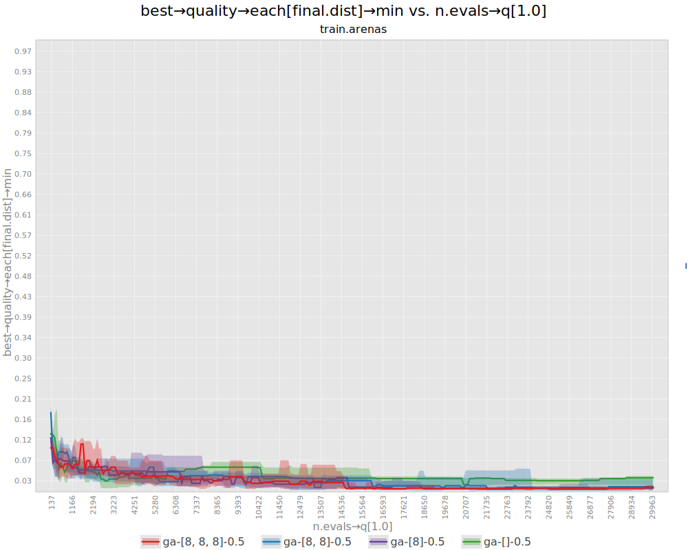
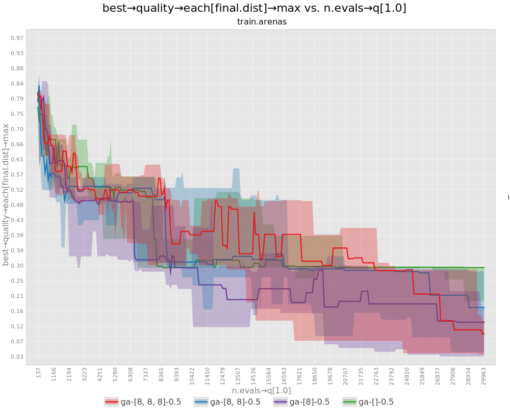
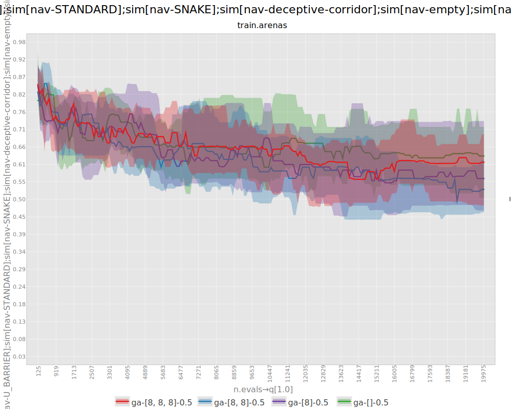
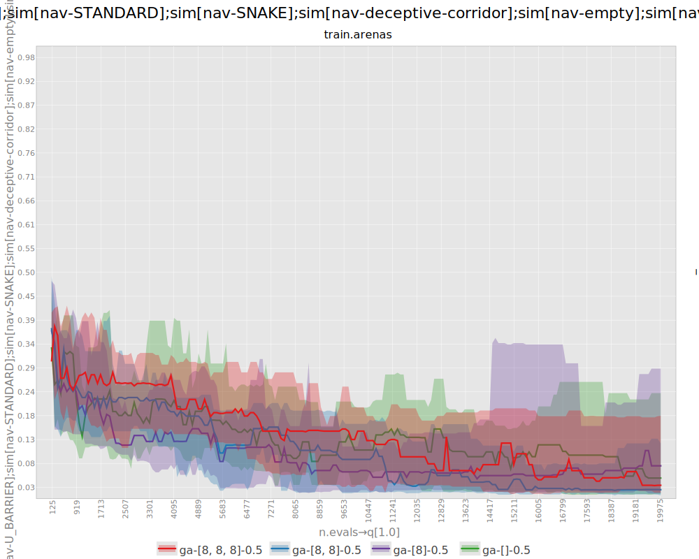
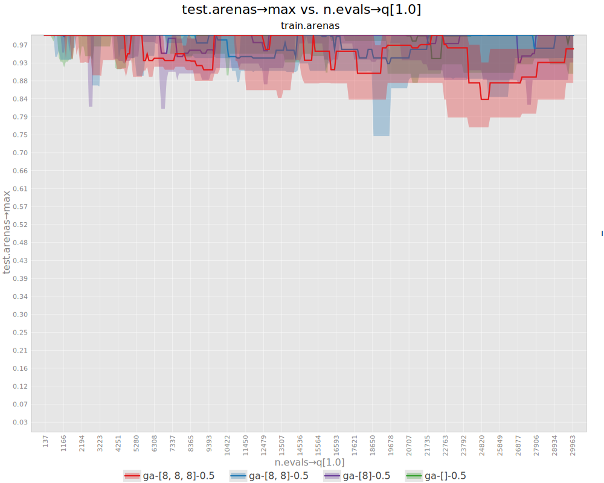
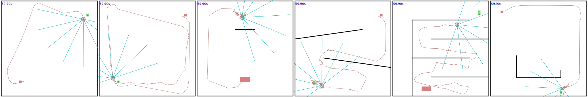
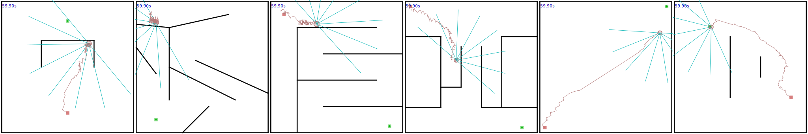
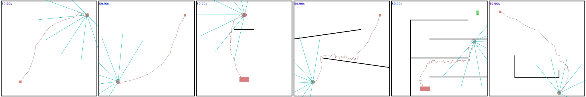
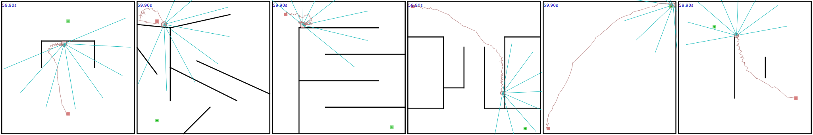

# neuroevolution-generality-comparison-navigation
Software artifacts related to a research on what factors impact on the generalization ability of neuroevolution in the case of 2D robot navigation.

## How to reproduce the experiments

### Requirements
- JDK 25

The binary of [JGEA](https://github.com/ericmedvet/jgea), the evolutionary framework these experiments are based on, is already available in this repo.

### Experiment: impact of the depth of the NN
```shell
java \
  -jar jgea.jar \
  -nt 16 -nr 4 \
  -f exp-files/nn-depth.txt \
  --expHeadLines \
    '$tFinal = 60' \
    '$nOfEvals = 20000' \
    '$seeds = [1:1:30]'
```

#### Plots

On training arenas:




On test arenas:




#### Examples (seed 1)

`[]` (no inner layers)



`[8]`



`[8, 8]`


`[8, 8, 8]`


### Experiment: impact of the width of the NN
```shell
java \
  -jar jgea.jar \
  -nt 16 -nr 4 \
  -f exp-files/nn-depth.txt \
  --expHeadLines \
    '$tFinal = 60' \
    '$nOfEvals = 20000' \
    '$seeds = [1:1:30]'
```

